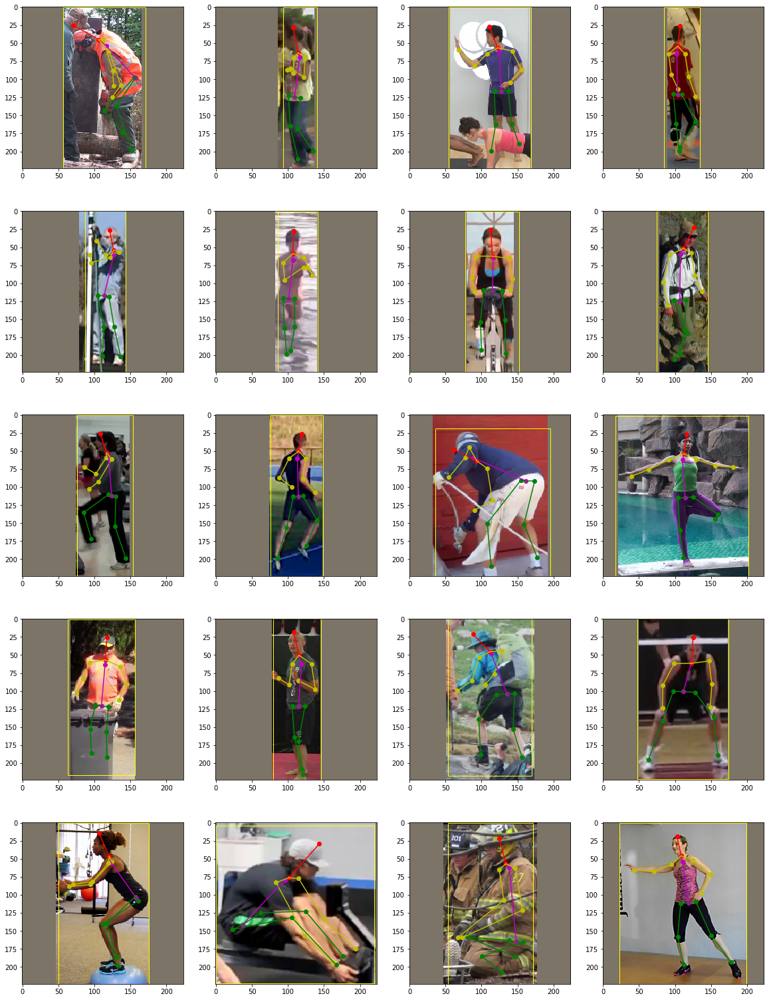

# MobilePose

MobilePose is a **Tiny** PyTorch implementation of single person 2D pose estimation framework. The aim is to provide the interface of the training/inference/evaluation, and the dataloader with various data augmentation options. And final trained model can satisfy basic requirements(speed+size+accuracy) for mobile device.

Some codes for networks and display are brought from:
1. [pytorch-mobilenet-v2](https://github.com/tonylins/pytorch-mobilenet-v2)
2. [Vanilla FCN, U-Net, SegNet, PSPNet, GCN, DUC](https://github.com/zijundeng/pytorch-semantic-segmentation)
3. [Shufflenet-v2-Pytorch](https://github.com/ericsun99/Shufflenet-v2-Pytorch)
4. [tf-pose-estimation](https://github.com/ildoonet/tf-pose-estimation) 
5. [dsntnn](https://github.com/anibali/dsntnn)

## NEWS!

- Mar 2019: Support running on webcam with decent FPS!  
- Feb 2019: **ALL** the pretrained model files are avaliable!

## Requirements

- Python 3.7
- PyTorch 1.0
- [dsntnn 1.0](https://github.com/anibali/dsntnn)

## Evaluation Results

|Model(+DUC+DSNTNN)|Parmas(M)|Flops(G)|AP@0.5:0.95|AP@0.5|AR@0.5:0.95|AR@0.5|Link|
|:---:|:---:|:---:|:---:|:---:|:---:|:---:|:---:|
|ResNet18|12.26|1.64|**68.2**|93.9|**79.7**|96.7|[51.5M](https://drive.google.com/open?id=17Z1zetIVDI4_8-ZoFgTRsjHtDpwGtjRT)|
|MobileNetV2|3.91|0.49|67.5|**94.9**|79.4|**97.1**|[16.6M](https://drive.google.com/open?id=15Ihv1bVQv6_tYTFlECJMNrXEmrrka5g4)|
|ShuffleNetV2|2.92|**0.31**|61.5|91.6|74.8|95.5|[12.4M](https://drive.google.com/open?id=184Zg4E6HbbizPFYcELMXCd7mwWXdUd3U)|
|SqueezeNet1.1|**2.22**|0.63|58.4|92.1|72.3|95.8|[9.3M](https://drive.google.com/open?id=1RePeiBJHeHvmYTQ5vAUJHC5CstHIBcP0)|

<div align="center">
    
</div>

## Features

- [x] multi-thread dataloader with augmentations (dataloader.py)
- [x] training and inference (training.py)
- [x] performance evaluation (eval.py)
- [x] multiple models support (network.py)
- [x] ipython notebook visualization (demo.ipynb)
- [x] camera realtime display script (run_webcam.py)

## Usage

1. Installation:

```shell
pip install -r requirements.txt
```

2. Training:

```shell
python training.py --model shufflenetv2 --gpu 0 --inputsize 224 --lr 1e-3 --batchsize 128 --t7 ./models/shufflenetv2_224_adam_best.t7
```

3. Evaluation

```shell
ln -s cocoapi/PythonAPI/pycocotools
cd cocoapi/PythonAPI && make

python eval.py --t7 ./models/resnet18_224_adam_best.t7 --model resnet18 --gpu 0
```

4. Web Camera Demo (Only pose estimation)
```shell
python run_webcam.py --model squeezenet --inp_dim 224 --camera 0
```

5. Identifying sign from image

```shell
python test.py --type {'img','vid', 'live'} --inp_path /path/to/image --output_dir /path/to/result --file path/to/file/storing/info  --plot False/True
```
OR
```shell
python detect_sign.py --inp_path /path/to/image --output_dir /path/to/result --file path/to/file/storing/info  --plot False/True
```
Optional arguments (only for detect_sign.py) : 
'--model' : 'resnet18' or 'mobilenetv2'; resnet18 gives best results
'--inp_dim' : Size to which image is resized

Default model is resnet18, can be changed to user requirement, options are resnet18 and mobilenetv2
Input size must be 224
Default output path is the 'output' folder, can be changed to user requirement

6. Identifying sign from video

i) Convert video to frames
```shell
python convert.py --video /path/to/video --out_dir /path/to/output/frames
```

ii) Apply model on the frames
```shell
python test.py --type vid --path /path/to/frames --out_dir /path/to/store/results --file /path/to/file/storing/info --plot False/True
```

## Contributors

MobilePose is developed and maintained by [Yuliang Xiu](http://xiuyuliang.cn/about/), [Zexin Chen](https://github.com/ZexinChen) and [Yinghong Fang](https://github.com/Fangyh09).

## License

MobilePose is freely available for free non-commercial use. For commercial queries, please contact [Cewu Lu](http://www.mvig.org/).